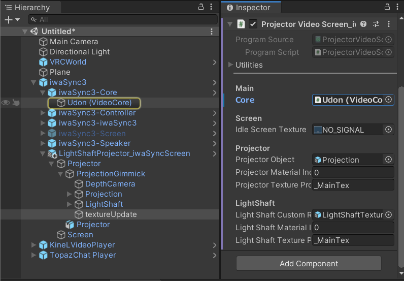
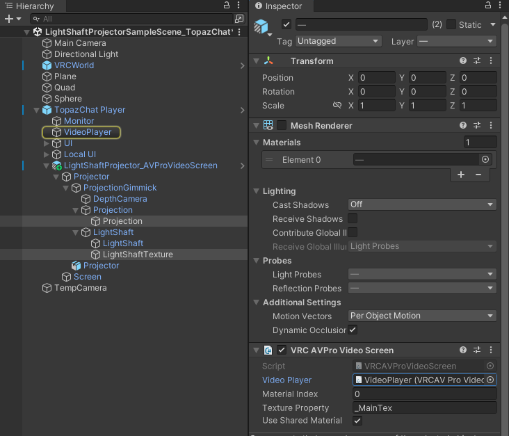
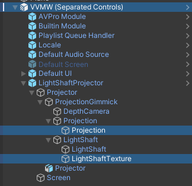
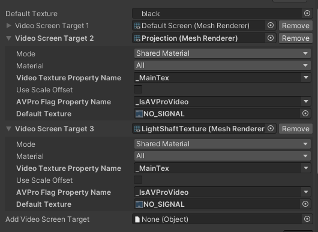
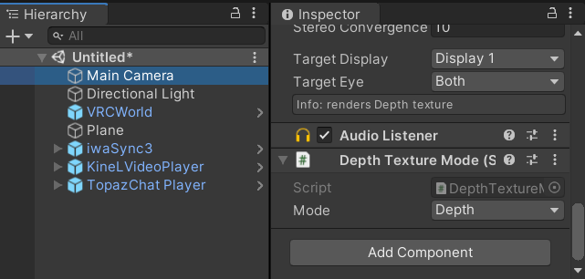
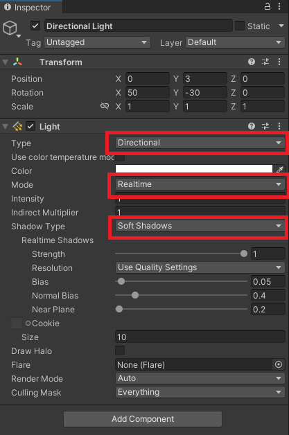
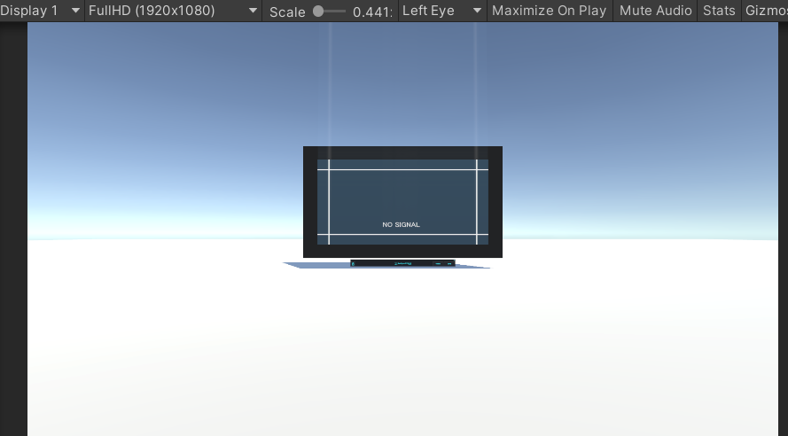
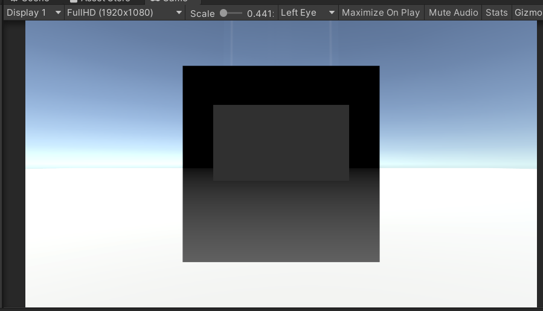

# Light Shaft Projector v2.1.0

## 1. 概要
本アセットはVRChatのワールド作成で利用することを想定した、
モデル・シェーダー・U#スクリプト を提供するものです。

サンプルワールド(v1.0.5)：
https://vrchat.com/home/world/wrld_845135e5-3e62-4f81-a9cb-4786cc5e3dfd

サンプルワールド(v2.0.0)：
https://vrchat.com/home/world/wrld_1843fa75-5d87-447d-a08c-87d630e7bec7

Unity2022対応。
VizVid, iwaSync3, KineL式(りら式)VideoPlayer, AVPro Video Player(TopazChat Player等)のスクリーンとして用いることができます。
* [VizVid](https://booth.pm/ja/items/5056077)
* [iwaSync3](https://hoshinolabs.booth.pm/items/2666275)
* [KineL式 VideoPlayer](https://kinel.booth.pm/items/2758684)
* [TopazChat Player](https://tyounanmoti.booth.pm/items/1752066)

投影対称物のマテリアルによっては正常に描画されない場合もございます。ご注意ください。

## 2. 動作確認環境
PCでのみ動作確認しています。
* Unity2022.3.22f1
* VRCSDK Base 3.6.1
* VRCSDK Worlds 3.6.1
* [VizVid v1.0.41](https://booth.pm/ja/items/5056077)
* [iwaSync3 v3.6.3](https://booth.pm/ja/items/2666275)
* [Kinel式 v2.5.5](https://booth.pm/ja/items/2758684)
* [TopazChat Player_3.3.1](https://booth.pm/ja/items/1752066)

## 3. 導入方法
### 3.1. 依存アセットのインポート
VideoPlayer(iwaSync3, Kinel式, VizVid)のスクリーンとして使用する場合は、先にVideoPlayerのアセットをインポートしてください。

### 3.2. LightShafrProjectorパッケージのインポート
LightShaftProjector.unitypackageをインポートしてください。

この際、依存アセットが存在しないことによるエラーを防ぐため、
* iwaSync3のスクリーンとして用いない場合は `Assets/LightShaftProjector/for_iwaSync` フォルダのチェックを外してください。
* Kinel式のスクリーンとして用いない場合は `Assets/LightShaftProjector/for_Kinel` フォルダのチェックを外してください。
* VizVidのスクリーンとして用いない場合は `Assets/LightShaftProjector/for_VizVid` フォルダのチェックを外してください。

### 3.3. Prefabの設置
#### 3.3.1. VideoPlayerへの対応が不要な場合
`Assets/LightShaftProjector/LightShaftProjector.prefab` をHierarchyに設置してください。

#### 3.3.2. iwaSync3のスクリーンとして用いる場合
`Assets/LightShaftProjector/for_iwaSync/LightShaftProjector_iwaSyncScreen.prefab` をHierarchyに設置してください。

`LightShaftProjector_iwaSyncScreen > Projector > ProjectionGimmick > textureUpdate` にアタッチされているU#スクリプト(ProjectorVideoScreen_iwaSync)のCoreにiwaSync3のCoreを設定してください。

#### 3.3.3. Kinel式のスクリーンとして用いる場合
`Assets/LightShaftProjector/for_Kinel/LightShaftProjector_KinelScreen.prefab` をHierarchyに設置してください。

`LightShaftProjector_iwaSyncScreen > Projector > ProjectionGimmick > textureUpdate` にアタッチされているU#スクリプト(ProjectorVideoScreen_Kinel)のVideo PlayerにKinelVideoPlayerのKineLVP Systemを設定してください。

    
#### 3.3.4. AVPro Video Playerのスクリーンとして用いる場合(TopazChat Player等)
1. `Assets/LightShaftProjector/for_AVProVideoPlayer/LightShaftProjector_AVProVideoScreen.prefab` をHierarchyに設置してください。

2. `LightShaftProjector_AVProVIdeoScreen > Projector > ProjectionGimmik`内にある、
   `Projection > Projection`および`LightShaft > LightShaftTexture`にアタッチされている`VRC AVPro Video Screen`のVideoPlayerに、`VRC AVPro Video Player`がアタッチされているオブジェクト(`VideoPlayer`)を設定してください。

   

3. `LightShaftProjector_AVProVIdeoScreen > Projector > ProjectionGimmik`内にある、`Projection > Projection`および`LightShaft > LightShaft`のマテリアルの`Is AVPro Video`にチェックを入れてください。 
   AVPro Videoモードの場合、テクスチャはガンマ補正されます。設定するテクスチャの設定のsRGBのチェックを外してください。

#### 3.3.5. VizVidのPlayerとして用いる場合
##### 3.3.5.1. VizVid用セットアップ済みPrefabを用いる場合
##### 3.3.5.2. 手動でVizVid用にセットアップする場合
1. `GameObject > VizVid > Video Player (Separated Controls)`を追加。
2. `Assets/LightShaftProjector//LightShaftProjector.prefab`を`VVMW (Separated Controls)`の子として配置。
3. `VVMW (Separated Controls)/Default Screen`は非表示に変更。

   

4. `VVMW (Separated Controls)`のInspectorのCoreコンポーネントにて

   

   1. `Video Screen Target 2`としてProjectionを追加
   2. `Video Screen Target 3`としてLightShaftTextureを追加。
   3. `Video Screen Target 2`および`Video Screen Target 3`のModeを`Shared Material`に変更。

### 3.4. _CameraDepthTextureの使用有無に対する設定

#### 3.4.1. _CameraDepthTextureを使用する場合
1. LightShaftマテリアルのUseCameraDepthにチェックを入れて下さい。
2. リファレンスカメラ(Main Camera)のDepthTextureModeを設定する必要があります。 
   VRC Scene DescriptorのReferece CameraにMain Cameraが設定されていることを確認してください。
3. Inspectorからはそのまま設定できないため、`Assets/LightShaftProjector/Scripts/DepthTextureMode.cs`をMain Cameraにアタッチし、ModeをDepthに変更してください。 
   
4. Realtimeかつシャドウタイプが影無し以外なDirectional Lightが存在することを確認。 
   
- ※_CameraDepthTextureはRealtimeかつ影ありのDirectionalLightが存在しないと生成されません。
- ※影を受けるマテリアルでないと`_CameraDepthTexture`に描き込まれないため正常に動作しません。
- ※DirectionalLightのCulling Maskで対象としていないオブジェクトでも_CameraDepthTextureには反映されます。

#### 3.4.2. _CameraDepthTextureを使用しない場合
LightShaftマテリアルを次のように設定する必要があります。
| Property | Value |
| --- | --- |
| UseCameraDepth | False |
| Cull | Off |
| ZTest | LessEqual |

前後関係を判断できず、一部の描写に制限がかかってしまいますが、
そこまで違和感なく表現できるかと思います。

## 4. その他の設定について
### 4.1. 投影する画像・映像の変更方法
ProjectionとLightShaftのマテリアルのTextureを指定してください。
(iwaSync3およびKinelとの連携については、U#からTextureの設定が行われます。)

### 4.2. プロジェクターを複数設置する場合
プロジェクターからのDepthをRenderTextureを使用して取得しているため、マテリアルを分けた上でことなるRenderTextureを設定する必要があります。

### 4.3. FOV(Field Of View)を変更する場合
Depthカメラ・Projector・マテリアル・LightShaftモデルの設定を合わせる必要があります。
FOV15°と30°のLightShaftモデルは用意してありますが、他のFOVが必要な場合は適宜用意をお願いいたします。

### 4.4. Tilt補正
プロジェクターの投影面を回転させることにより、斜めから投影しても正しい形で投影することが可能です。
1. LightShaftProjectorのPrefabのルートを投影面に正対するように回転させる。
2. `ProjectionGimmick`を投影したい角度に調整
3. マテリアル `ProjectionWidthDepth`, `LightShaft`のScreen Tiltに、`ProjectionGimmick`のRotation値を入力。

## 5. トラブルシューティング
### 5.1. _CameraDepthTextureを生成出来ているかチェックしたい。
_CameraDepthTextureの内容を描画するシェーダーを作成しました。

`Assets/LightShaftProjector/Debug/CameraDepthTextureTestPlane.prefab`をHierarchyに配置してください。

プレーンを置く前 

プレーンを置いた後 

正常に_CameraDepthTextureが生成されていると、このように深度が表示されます。

## 6. 利用規約
本データはVN3ライセンスにて公開しております。
規約は下記のリンクをご確認ください。

【日本語】 
https://drive.google.com/file/d/1fZ-5i4ItK_Tpkdhhth_YFttbmicsT8yC/view?usp=sharing

【English】 
https://drive.google.com/file/d/1AaNaz9FnGFHD2i7_KNv_PmkcEFN4dnSU/view?usp=sharing

## 7. 更新履歴
### 2024/6/21 v2.1.1
* `LightShaftProjector_AVProVideoScreen.prefab`の`Use Shared Material`のチェックが外れていたので修正。
* Directional Lightの影条件とAVPro Video Playerで使用する際の設定部のマニュアルを更新。
* Unity 2022.3.22f1に更新。
* VRCSDK 3.6.1での動作を確認。
* VizVid v1.0.41での動作を確認。
* iwaSync v3.6.3での動作を確認。

### 2024/3/13 v2.1.0
* Unity 2022.3.6f1に更新
* VizVid v1.0.28のサポートを追加。
* Kinel式をv2.5.5対応に更新。
* iwaSync v3.6.0での動作を確認。

### 2023/7/4 v2.0.0
* リファクタリング
* 影の描画品質を向上
* 処理負荷を軽減
* カメラと鏡に映るようにレイヤーを変更
* プロジェクターのモデルを更新
* テクスチャの設定を更新
* フォルダ構成を整理
* AVPro Video Screenとしての動作を確認

※互換性の無い更新が多く含まれます。 
**プロジェクトのバックアップを取った上で**、既存のLight Shaft Projectorのフォルダを削除してからインポートしてください。

### 2023/6/21 v1.2.0
* UdonSharp v1.1.8での動作を確認。
* iwaSync v3.5.5での動作を確認。
* Kinel Video Player v2.4.3_U_1.xに対応。

### 2023/3/11 v.1.1.1
* _CameraDepthTextureが生成されているか確認するシェーダーを追加。

### 2022/11/27 v1.1.0
* Kinel式 VideoPlayerのスクリーンとして使用するためのスクリプトを追加。

### 2022/11/24 v1.0.9
* idle画像を変更。
* iwaSync用のUdonスクリプトをVCCのU#1.0に移行。 
  VCCに移行していないプロジェクトではiwaSyncの画面として動作しなくなります。 
  VCCに移行する際はiwaSyncも更新が必要となりますのでご注意ください。

### 2022/8/13 v1.0.8
* Projectorの光が当たらない場所にProjectionされる場合があった不具合を修正。

### 2022/8/12 v1.0.7
* iwaSync3 U#1.0版に対応したpackageを追加。

### 2022/6/4 v1.0.6
* アスペクト比が異なるテクスチャを入力しても正しく表示するように変更。

### 2022/3/25 v1.0.5
* LightShaftの描画品質向上
* マテリアルのCull設定等をプロパティに追加。
* iwaSync3との連携コンポーネントを1つに集約

### 2022/1/16 v1.0.4
* iwaSyncでLiveを再生した際に上下反転していた不具合を修正。

### 2021/11/7 v1.0.3
* シェーダーをまとめてシンプルに(CameraDepthTextureで分けていたシェーダーはマテリアル設定で切り替えるように変更しました。)
* 最低限必要なデータに絞ってファイル構成をシンプルに

### 2021/9/6 v1.0.2
* 投影角度補正機能を追加。
* マテリアルのフォルダを整理。

### 2021/9/3 v1.0.1
* LightShaftの距離減衰の計算を修正。
* Boothで販売開始。

### 2021/9/3 v1.0.0
* 販売前テスト

## 8. その他
製作者
: takec

Twitter
: @takec_vrc

販売サイト
: https://takec.booth.pm/
